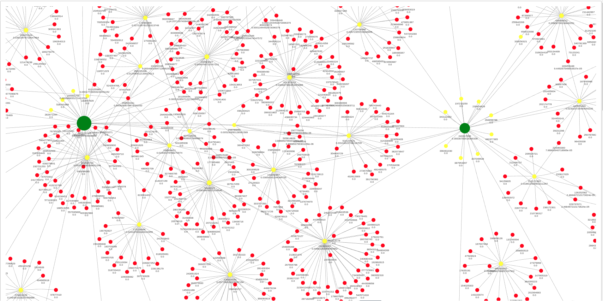

# VK graph друзей
Лабораторная работа заключалась в анализе социальных связей на основе данных социальной сети ВКонтакте (VK). Основной задачей было составление графа друзей, где вершинами графа выступают пользователи, а ребра между ними указывают на наличие дружеских отношений.

### 1. **Сбор данных**
Первым этапом работы было получение данных о пользователях и их друзьях с помощью API ВКонтакте. Необходимо было выбрать одного пользователя, с которого начнется анализ, и собрать список его друзей, а также друзей его друзей для построения полного графа. Для этого использовались запросы к методам API, позволяющим получать списки друзей по идентификаторам пользователей. Поскольку количество запросов ограничено, следовало учесть, как оптимизировать их число и организовать сбор данных в пределах допустимых лимитов.

### 2. **Построение графа**
После сбора данных следующим этапом было построение графа. Для этого использовались графовые структуры, такие как *NetworkX* в Python или аналогичные инструменты. Вершины графа представляли пользователей, а ребра — отношения дружбы между ними. Смысл графа заключался в том, чтобы визуально и математически отразить взаимосвязи в социальной сети, а также выявить наиболее влиятельных пользователей.

### 3. **Расчет центральностей**
После построения графа необходимо было выполнить расчет различных показателей центральности, которые помогают выявить ключевых участников социальной сети. Рассматривались следующие виды центральности:

- **Степенная центральность (Degree Centrality):** показывает, сколько друзей есть у каждого пользователя. Вершины с высокой степенью центральности могут рассматриваться как пользователи с большим количеством связей.
  
- **Междуцентровая центральность (Betweenness Centrality):** отражает, сколько кратчайших путей между другими вершинами проходят через данную вершину. Пользователи с высокой междуцентровой центральностью играют роль "мостов" в социальной сети, соединяя разные группы людей.

- **Близостная центральность (Closeness Centrality):** показывает, насколько быстро пользователь может достичь других пользователей в графе. Высокое значение близостной центральности указывает на то, что пользователь находится в центре сети и имеет быстрый доступ ко многим другим участникам.

- **Эйгенвекторная центральность (Eigenvector Centrality):** оценивает влияние пользователя не только на основе числа его друзей, но и на основе их важности. Пользователи с высокими значениями эйгенвекторной центральности имеют связи с другими пользователями, которые сами по себе являются центральными фигурами в графе.

### 4. **Визуализация графа**
После расчета центральностей необходимо было визуализировать граф, выделив пользователей с наиболее высокими показателями центральности. Для этого использовались различные методы визуализации графов, такие как раскраска узлов в зависимости от их значений центральности или изменение размеров вершин в соответствии с количеством связей. Это позволило наглядно показать, как пользователи взаимосвязаны в социальной сети и кто из них является наиболее влиятельным.

## Описание файлов
В data находится информация обо всех связях в виде json файлов.
Также в этой папке находится информация об ID пользователей из группы.

Например, группа 209 и их соответствие vk_id выглядит так:
```json
{
    "Alimov": 290530655,
    "Brezhnev":1931147,
    "Volkov":207227130,
    "Kiryanov":24435047,
    "Kravzov":138042735,
    "Lavrenchenko":172244589,
    "Lagutkina":168420440,
    "Ligun":711398942,
    "Peshkov":65657314,
    "Prozorov":176183602,
    "Svinarenko": 50933461,
    "Xrennikova":198216820,
    "Yaminov":268235974
}
```

В файле `graph.json`представлена сохраненная копия зависимостей друзей для того, чтобы не было необходимости скачивать из API VK каждый раз информацию о пользователях.

## Демонстрация графов


Для более подробного рассмотрения графов, можно запустить html файлы в любом браузере, которые расположены в папке `graphs`.